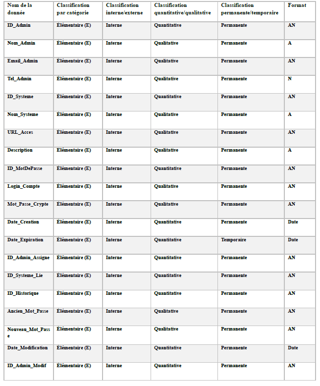
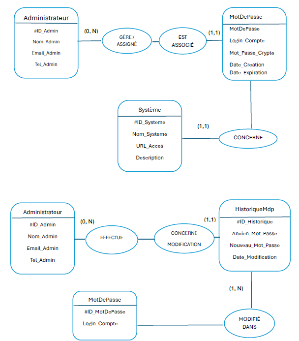
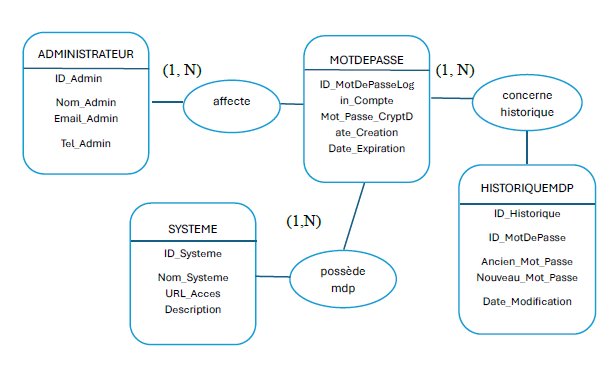
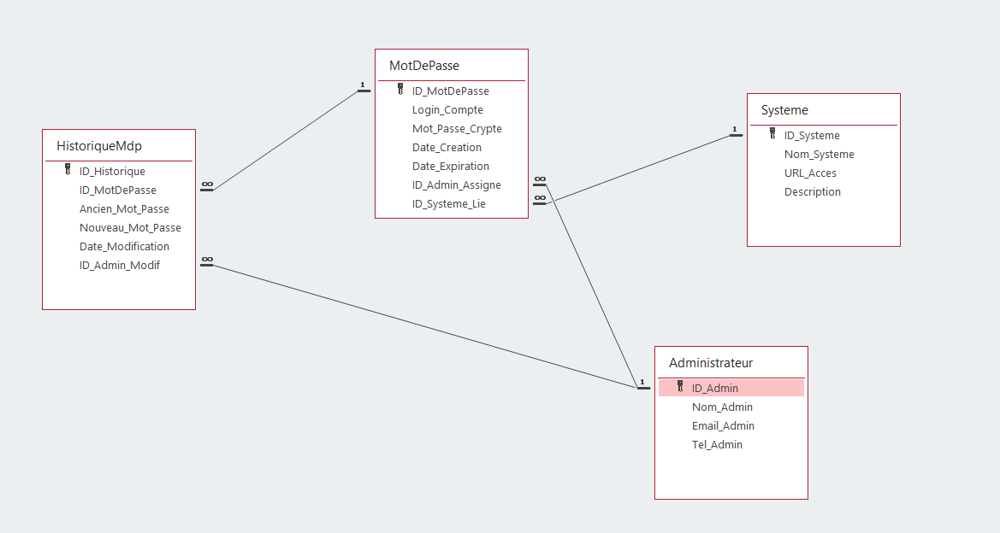
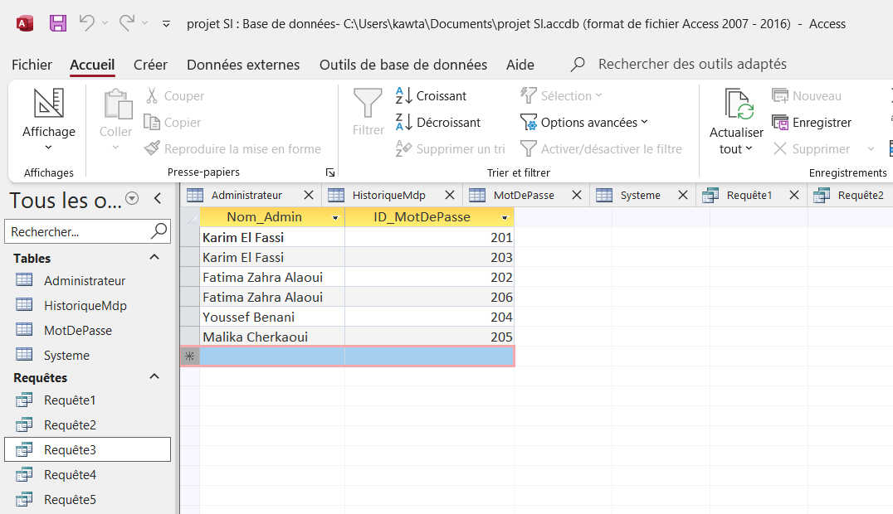
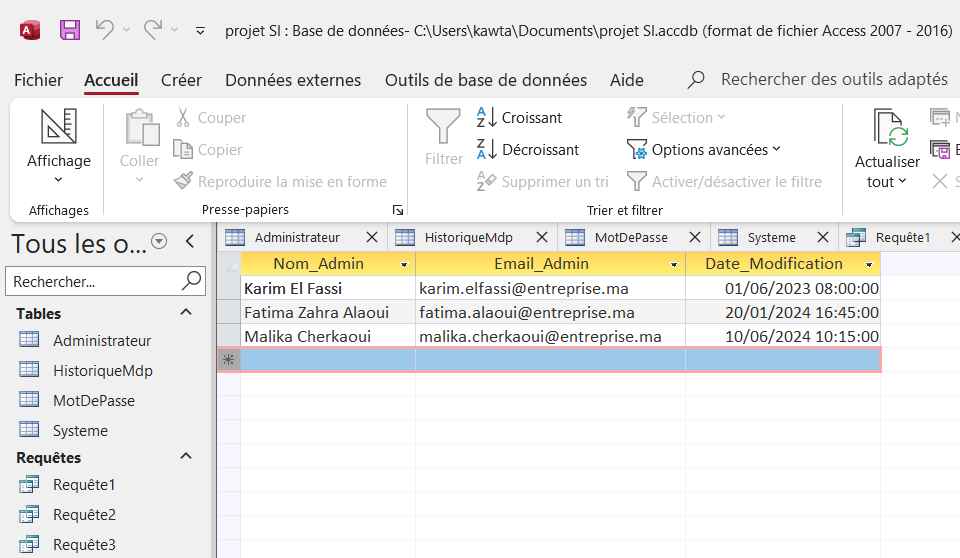

# 🛡️ Modélisation et Audit : Registre Sécurisé des Mots de Passe Administrateurs

Ce projet documente la conception et l'implémentation d'un **Système d'Information (SI)** critique destiné à la gestion et à l'audit des mots de passe des comptes administrateurs. L'objectif principal est d'établir une solution robuste garantissant la **sécurité, la traçabilité et la gouvernance des données** sensibles.

| Informations du Projet | Détails |
| :--- | :--- |
| **Objectif Principal** | Assurer le stockage sécurisé (crypté) et la traçabilité complète des modifications des identifiants et mots de passe. |
| **Compétences Clés** | Architecture de Données (MCD/MLD), Data Governance, SQL Querying, Audit Trail, Intégrité Référentielle. |
| **Outil d'Implémentation**| Microsoft Access (Base de Données Relationnelle). |

---

## 🚀 Valorisation des Compétences Techniques

Ce projet met en lumière les compétences fondamentales en ingénierie et architecture de données :

1.  **Modélisation de Données :** Maîtrise de la traduction des besoins fonctionnels en schémas de données structurés (MCD et MLD).
2.  **Gouvernance des Données :** Définition des standards (dictionnaire de données) pour la qualité et la classification de l'information.
3.  **Audit Trail :** Conception du mécanisme d'**historisation** (via l'entité `HistoriqueMdp`) indispensable pour la conformité et la vérification des actions.
4.  **Sécurité :** Prise en compte de l'obligation de stocker les mots de passe sous forme **cryptée** (via l'attribut `Mot_Passe_Crypte`).

---

## 📋 Les Étapes de Conception et de Modélisation

### 1. Dictionnaire de Données et Classification

**Analyse :** Le dictionnaire de données (page 4) établit la **norme et la structure** de chaque attribut utilisé dans le système. Il spécifie le format, la nature (qualitative/quantitative) et la classification des données, un pilier essentiel de la **Data Governance**.

### 2. Modèle Conceptuel de Données (MCD)

**Analyse :** Le MCD (page 6) représente la structure logique du système. Il définit les entités principales (`Administrateur`, `MotDePasse`, `HistoriqueMdp`) et les **règles de gestion** via les cardinalités. Il modélise notamment la relation d'**Historisation**, garantissant qu'aucune modification de mot de passe ne puisse se faire sans laisser de trace.

### 3. Modèle Logique de Données (MLD)

**Analyse :** Le MLD (page 8) est la traduction du MCD en un schéma physique prêt pour l'implémentation. Il définit formellement les tables, les clés primaires (PK) et les clés étrangères (FK), assurant la **non-redondance** et l'optimisation des requêtes.

---

## 🛠️ Implémentation et Fonctionnalités d'Audit

### 1. Relations entre les Tables (Intégrité Référentielle)

**Analyse :** Ce schéma (page 11) montre la mise en œuvre des jointures entre les tables dans Access. L'établissement des relations est crucial pour maintenir l'**Intégrité Référentielle** : le système empêche toute suppression ou modification qui pourrait compromettre la cohérence historique des données.

### 2. Requêtes d'Audit (SQL Querying)

Ces requêtes démontrent la capacité du système à générer des **pistes d'audit (Audit Trail)** grâce à l'historisation des données :

* **Requête 3 : Responsabilité des Administrateurs**
    **Analyse :** Cette requête utilise des jointures SQL pour identifier clairement quels mots de passe sont attribués à quel administrateur. Elle établit une chaîne de **responsabilité** immédiate au sein du système.
    

* **Requête 4 : Trace des Modifications (Audit Trail)**
    **Analyse :** Cette requête est le cœur de l'audit (page 13). Elle extrait de la table `HistoriqueMdp` les informations sur **qui** (`Nom_Admin`, `Email_Admin`) a effectué la modification, **quand** (`Date_Modification`) et sur quel mot de passe. Elle répond directement aux exigences de **conformité et de traçabilité**.
    

---

### 📚 Documentation Complète
* [Rapport Complet du Projet de Système d'Information (PDF)](Rapport_Modelisation_Audit_MotsDePasse.pdf)
